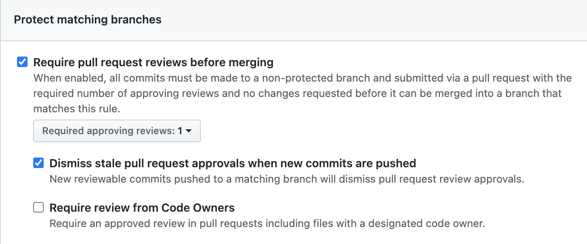
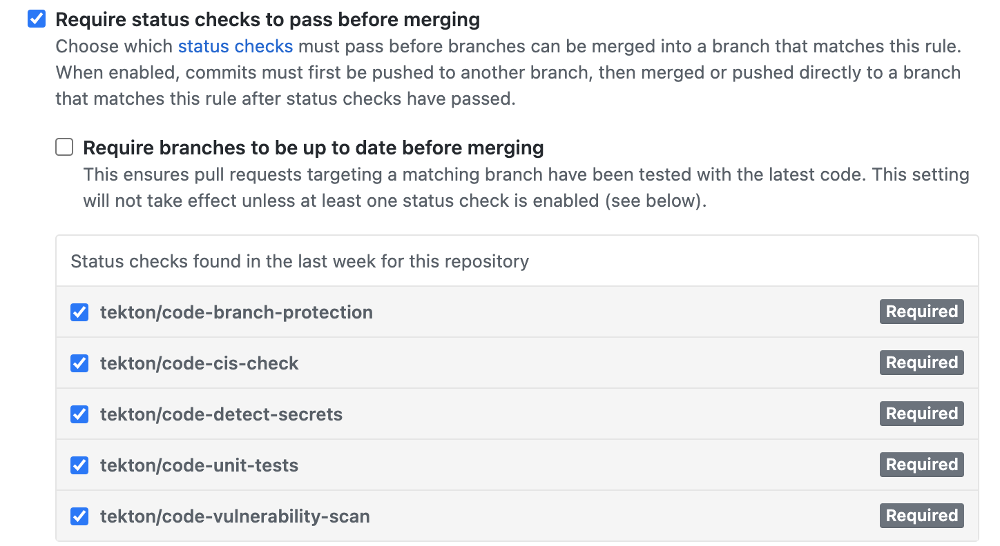

---

copyright:
  years: 2021
lastupdated: "2021-06-30"

keywords: DevSecOps

subcollection: ContinuousDelivery

---

{:shortdesc: .shortdesc}
{:table: .aria-labeledby="caption"}
{:external: target="_blank" .external}
{:codeblock: .codeblock}
{:pre: .pre}
{:screen: .screen}
{:tip: .tip}
{:note: .note}
{:important: .important}
{:download: .download}
{:help: data-hd-content-type='help'}
{:support: data-reuse='support'}

# Configuring GitHub repos
{: #cd-devsecops-config-github}

You can configure the branch protection rules on the settings tab in your GitHub repository (repo).
{: shortdesc}

1. Add the required branch protection rules.

 

1. Add the following rules to the master branch of your repo:

 

1. Approve pull requests before merging them to master.

 

1. Status checks must pass before you can merge a pull request. To set a status check, trigger a pull request pipeline or CI pipeline. Only existing status checks are listed in the UI.

1. To set branch protection rules, issue the following cURL command after replacing the `$GH_TOKEN`, `$OWNER`, and `$REPO` variables. In the sample `hello-compliance-app`, this command sets the branch protection settings by default by way of the `.pipeline-config.yaml` setup stage.

```
curl -u ":$GH_TOKEN" https://github.ibm.com/api/v3/repos/$OWNER/$REPO/branches/master/protection -XPUT -d '{"required_pull_request_reviews":{"dismiss_stale_reviews":true},"required_status_checks":{"strict":true,"contexts":["tekton/code-branch-protection","tekton/code-unit-tests","tekton/code-cis-check","tekton/code-vulnerability-scan","tekton/code-detect-secrets"]},"enforce_admins":null,"restrictions":null}'
```
{: codeblock}
