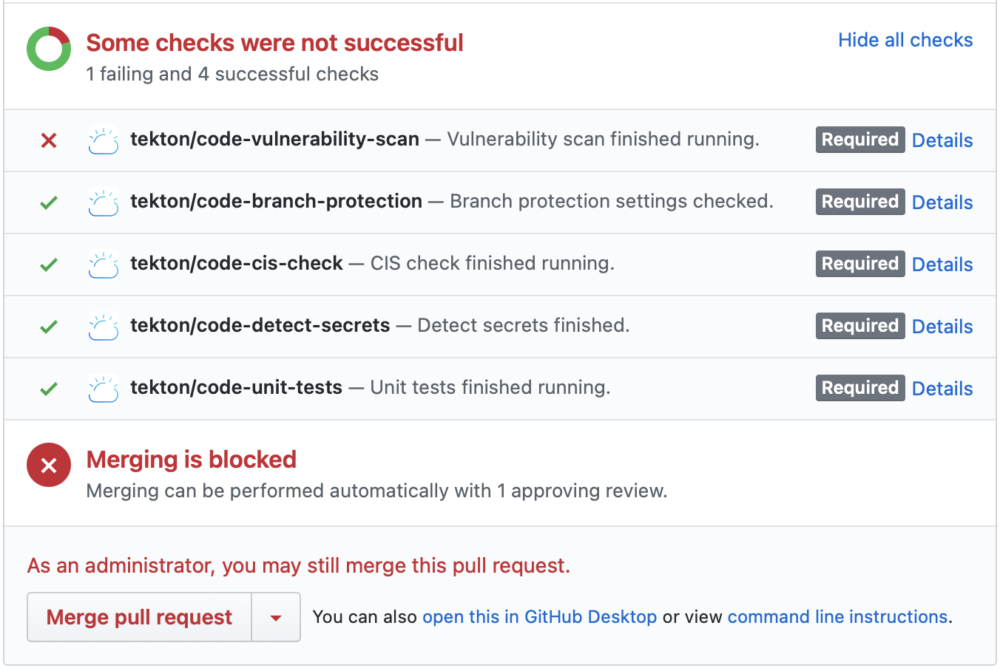
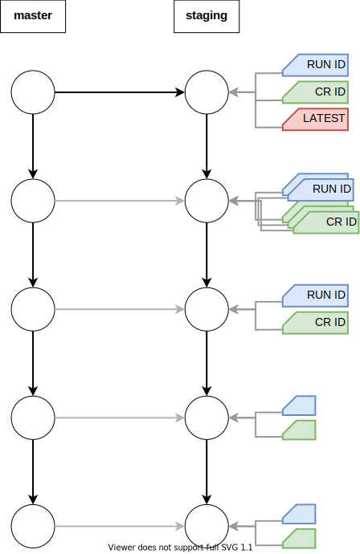

---

copyright:
  years: 2021
lastupdated: "2021-06-25"

keywords: DevSecOps

subcollection: ContinuousDelivery

---

{:shortdesc: .shortdesc}
{:table: .aria-labeledby="caption"}
{:external: target="_blank" .external}
{:codeblock: .codeblock}
{:pre: .pre}
{:screen: .screen}
{:tip: .tip}
{:note: .note}
{:important: .important}
{:download: .download}
{:help: data-hd-content-type='help'}
{:support: data-reuse='support'}

# Understanding DevSecOps pipelines
{: #cd-devsecops-pipelines}

The various pipelines that are provided in the reference continuous integation and continuous delivery toolchains are based on the {{site.data.keyword.contdelivery_short}} support for Tekton Pipelines.
{: shortdesc}

To learn more about Tekton Pipelines, see [Working with Tekton pipelines](/docs/ContinuousDelivery?topic=ContinuousDelivery-tekton-pipelines). You do not need to be a Tekton expert to use the reference pipelines. These pipelines are predefined with a basic structure that includes placeholders for custom scripts for steps such as builds, automated tests, and deployment.  Users can declare their custom scripts for their own pipelines and set values for various environment properties for a specific pipeline.

## Pipeline statuses
{: #cd-devsecops-pipelines-statuses}

It's important to understand the error or failure conditions for a reference pipeline at certain points. Conceptually, there are two different types of status that result from a task run in a compliance pipeline:

* Compliance status: The pass or fail state of a some check or set of checks.
* Pipeline status: The success or failure state of a task execution itself.

If a test, scan, or check fails, it does  not cause the pipeline itself to fail or terminate; the task running the test is marked as green.
{: tip}

From a compliance point of view, the result of the unit test does not impact the deployment. You can deploy artifacts with failed checks, but the process keeps evidence about that activity. The compliance flow should not block you from releasing a fix in the case of an outage. For example, a green run for a unit test task that found failing tests means the following:

`The task ran successfully and found the following issues`

If a task fails with a red status, it occurs because the pipeline cannot, or should not, continue. Example conditions for failure include:

* Errors in a task or in the pipeline.
* Something happened that means it makes no sense to keep the pipeline running.

For example, if an artifact build fails in the continuous integration, it breaks the purpose of the continuous integration process itself.

To keep the final pipeline status in sync with the compliance results, there is a task at the end of the pipeline that checks the compliance results and sets the pipeline run status to either `red` or `green`.

## Pull request pipeline
{: #cd-devsecops-pipelines-pr-pipeline}

The pull request pipeline runs pre-set compliance status checks on a pull request for the specified application (app) repository (repo). These status checks might prevent you from merging the pull request into the master branch if the checks are unsuccessful. Open or update a pull request against the master branch to trigger the pull request pipeline run. Users can run their own setup for the pipeline and tests in custom stages. For more information about the pull request pipeline, see [Pull request pipeline](/docs/ContinuousDelivery?topic=ContinuousDelivery-cd-devsecops-pr-pipeline).

### Pipeline order
{: #cd-devsecops-pipelines-order}

The following table describes the tasks and steps that run as part of the pull request pipeline.

| Task | Steps | Description | Task jobs |
|----------|---------|---------|---------|
| code-pr-start | start prepare-next-stage | pipeline initialization | Clone app repos, clone the pipeline repo, set the initial pending state for status checks on Git Repo and Issue Tracking repos. |
| code-setup | prepare run-stage prepare-next-stage | user-defined script setup stage | Placeholder for a user-defined `setup` [custom script](/docs/ContinuousDelivery?topic=ContinuousDelivery-cd-devsecops-custom-scripts), where the user can complete their pipeline setup. |
| code-unit-tests | prepare run-stage prepare-next-stage | user_defined script unit tests stage | Placeholder for a user-defined `test` [custom script](/docs/ContinuousDelivery?topic=ContinuousDelivery-cd-devsecops-custom-scripts), where the user can run their own tests. |
| code-pr-finish | prepare detect-secrets cra-discovery cra-remediation cra-remediation-comment cra-cis-check cra-cis-check-comment finish | run compliance checks | Run all of the required compliance checks, comment the results to the pull request, and set their result as status on Git Repo and Issue Tracking repos. |
{: caption="Table 1. Pull request pipeline order" caption-side="bottom"}

#### Task jobs
{: #cd-devsecops-pipelines-task-jobs}

* `code-pr-start`: Clone application repos, clone pipeline repo, set the initial pending state for status checks on Git Repo and Issue Tracking repos.
* `code-setup`: Placeholder for a user-defined `setup` [custom script](/docs/ContinuousDelivery?topic=ContinuousDelivery-cd-devsecops-custom-scripts), where the user can complete their pipeline setup.
* `code-unit-tests`: Placeholder for a user-defined `test` [custom script](/docs/ContinuousDelivery?topic=ContinuousDelivery-cd-devsecops-custom-scripts), where the user can run their own tests.
* `code-pr-finish`: Run all of the required compliance checks, comment the results to the pull request, and and set their result on Git Repo and Issue Tracking repos.

### Merging pull requests with issues
{: #cd-devsecops-pipelines-merge-pr}

You can merge pull requests with failed status checks if you have administrator rights to the repo. However, merging these pull requests registers a `failure` result in its evidence for the failing task, which is included in the evidence summary, change request description, and impacts the final compliance score in the Security and Compliance Center.

{: caption="Figure 1. Pull request with failed status checks" caption-side="bottom"}

### Environment properties
{: #cd-devsecops-pipelines-env-properties}

The table below provides a list and a short explanation of the parameters provided for the PR pipeline out-of-the-box.

| Name | Type | Description | Required or Optional |
|----------|---------|---------|---------|
| artifactory-dockerconfigjson | SECRET | Base64 encoded docker `config.json` to pull the pipeline compliance images. | Optional |
| baseimage-auth-user | text | Credentials for the base image of the application Dockerfile, required by Code Risk Analyzer scan. | Optional |
| baseimage-auth-email | text | Credentials for the base image of the application Dockerfile, required by Code Risk Analyzer scan. | Optional |
| baseimage-auth-host | text | Credentials for the base image of the application Dockerfile, required by Code Risk Analyzer scan. | Optional |
| baseimage-auth-password | SECRET | Credentials for the base image of the application Dockerfile, required by Code Risk Analyzer scan. | Optional |
| git-token | SECRET | Git Repo and Issue Tracking access token. | Optional |
| ibmcloud-api-key | SECRET | IBM Cloud API key that is used to interact with the `ibmcloud` cli tool. | Required |
| pipeline-config | text | Configuration file that is used to customize pipeline behavior. | Optional |
| pipeline-config-branch | text | The branch of the pipeline config. | Optional |
| pipeline-config-repo | text | Repository URL of the pipeline config location. | Optional |
| pipeline-dockerconfigjson | SECRET | Base64 encoded Docker `config.json` file for pulling images from a private registry. | Optional |
| pipeline-debug | select | Pipeline debug mode switch | Optional |
| slack-notifications | text | Switch to turn the Slack integration on or  off. | Optional |

You can add parameters to the pipelines from the pipeline UI and access them from the [user-defined scripts](/docs/ContinuousDelivery?topic=ContinuousDelivery-cd-devsecops-custom-scripts).
{: tip}

## Integration with {{site.data.keyword.compliance_short}}
{: #cd-devsecops-pipelines-scc}

See [Using the {{site.data.keyword.compliance_full}} with DevSecOps toolchains](/docs/ContinuousDelivery?topic=ContinuousDelivery-cd-devsecops-scc-toolchains).

## Inventory workflow
{: #cd-devsecops-pipelines-inventory-workflow}

See [Evidence](/docs/ContinuousDelivery?topic=ContinuousDelivery-cd-devsecops-evidence).

See [Inventory](/docs/ContinuousDelivery?topic=ContinuousDelivery-cd-devsecops-inventory).

### Continuous integration writes to Inventory
{: #cd-devsecops-pipelines-inventory-writes}

Inventory contains several branches, including the master branch. These branches can represent deployment stages, environments, or regions, or some of these mixed together, depending on the setup and usage.

The master branch is populated from continuous integration builds. The last commit in the target (in this case named "staging") has a tag attached that shows it was the last concluded deployment.

### Promotion
{: #cd-devsecops-pipelines-inventory-promotion}

To promote to a target branch, create a pull request. Pull request contents populate the change request fields. After it is reviewed, you can merge the promotion pull request.

### Delta and deployment
{: #cd-devsecops-pipelines-inventory-delta}

After the promotion pull request is merged, the deployment pipeline can start. The deployment delta is the difference between the contents of the last concluded deployment and the current deployment. The deployment delta lists the inventory items that are being deployed.

### Conclude
{: #cd-devsecops-pipelines-inventory-conclude}

When the deployment finishes, the `latest` tag  is moved ahead.

### Promote to further environments
{: #cd-devsecops-pipelines-inventory-promote-env}

Promotion and deployment can happen from any branch to another one.

### Inventory landscape
{: #cd-devsecops-pipelines-inventory-landscape}

The latest, deployed state holds the content to deploy to an environment. Every promoted commit in the target branches contains the relevant Pipeline Run ID and Change Request ID, as tag. Some commits can have multiple tags, such as when a failed deployment is run again. The Inventory stores each piece of information to replay the deployments.

{: caption="Figure 2. Inventory landscape" caption-side="bottom"}

#### Use of tags
{: #cd-devsecops-pipelines-inventory-tags}

* `latest`: Tags the latest, successfully deployed and concluded state of the inventory on a branch.
* `pipeline run id`: Tags the most recent inventory state in the branch, with the pipeline run id or the build number of the actual deployment. You can use this information to refer to the actual inventory point hash in the branch history so that when parallel deployments are triggered you avoid inventory content overlapping.
* `change request id`: Optional. Tags the current state. Change request IDs are historically represented and tracked in the inventory.

### Single target - multiple region setup
{: #cd-devsecops-pipelines-single-target-multi-region}

The  single target - multiple region setup is an iteration on this model where multiple `latest` tags for a single target environment are introduced, so that multiple continuous pipelines can work on the same target for different types of use cases.

For example, you can use the same target environment for multiple regions (such as us-south and eu-de) in prod target environment and the inventory branch.

Teams do not need to set up a different branch for each region, such as `prod-us-south` and `prod-eu-de`, and run the promotion redundantly. Instead, specify these additional targets for the same inventory branch and then use them as Git tags.

In this setup, the prod branch has multiple `latest` tags on the same branch, such as `prod-latest:us-south` and `prod-latest:eu-de`, and each continuous delivery pipeline that is responsible for each region can use those tags to deploy.

{: caption="Figure 3. Single target - multiple region setup" caption-side="bottom"}

#### Example scenario
{: #cd-devsecops-pipelines-inventory-example}

A set of changes, that can eventually be deployed everywhere, might be released to a single region first. You can then gradually deploy this set of changes to other regions by using continuous delivery pipelines that target those regions.
