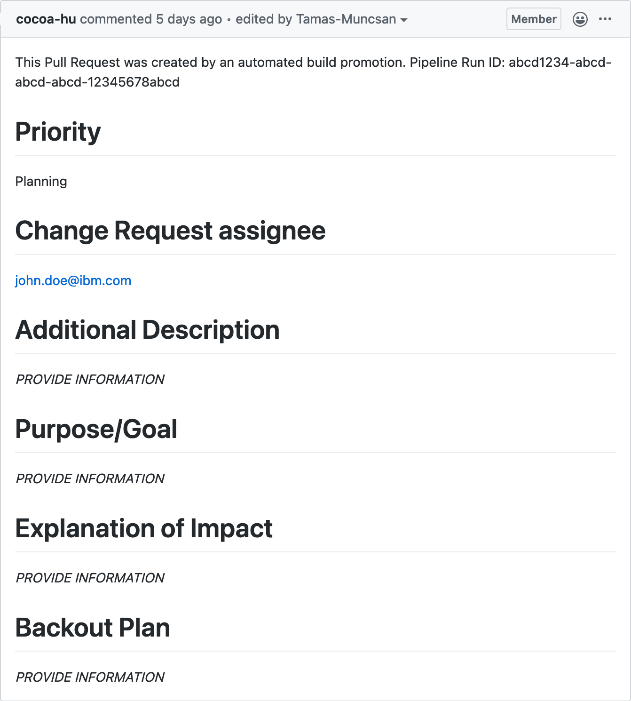

---

copyright:
  years: 2021
lastupdated: "2021-06-29"

keywords: DevSecOps

subcollection: ContinuousDelivery

---

{:shortdesc: .shortdesc}
{:table: .aria-labeledby="caption"}
{:external: target="_blank" .external}
{:codeblock: .codeblock}
{:pre: .pre}
{:screen: .screen}
{:tip: .tip}
{:note: .note}
{:important: .important}
{:download: .download}
{:help: data-hd-content-type='help'}
{:support: data-reuse='support'}

# Promotion pipeline
{: #cd-devsecops-promotion-pipeline}

The promotion pipeline promotes inventory entries from one environment to another and creates a promotion pull request.
{: shortdesc}

## Promotion pipeline steps
{: #cd-devsecops-promotion-pipelinesteps}

1. Get inputs for the promotion and the promotion pull request.
2. Promote the inventory entries from the source environment to the target environment.
3. Create the promotion pull request.
4. Send a Slack notification, if the feature is turned on.

## Running the promotion pipeline
{: #cd-devsecops-promotion-pipelinerun}

Use the manual promotion trigger to run the promotion pipeline. If the source (master) branch is ahead of the target (prod) branch, the pipeline creates a promotion pull request that you can review and edit. If the source branch is behind the target, the promotion pipeline fails with the `All changes have already been promoted` message.

To modify the default values of the promotion pull request, or to promote from an alternative source to target, users can modify the inputs from the Pipeline Environment Variables UI.

Before you run the continuous delivery pipeline, make sure that the promotion pull request is merged.
{: tip}

For more information about the inventory and promotion process, see [Inventory promotion](/docs/ContinuousDelivery?topic=ContinuousDelivery-cd-devsecops-inventory).

## Promotion pull requests
{: #cd-devsecops-promotion-pipelinepr}

The information from the body of the promotion pull request is used to create the change request. Files that are changed by the promotion pull request represent the entries, such as images, that are deployed by the continuous delivery pipeline. If the changes were made because of an emergency, the promotion pull request is marked with an emergency label. The change request that is created by the continuous delivery pipeline is also marked as `emergency`.
    
## Inputs
{: #cd-devsecops-promotion-pipelineinputs}

|Variable |Description	|Default value |Required or optional |
|:----------|:------------------------------|:------------------|:----------|
|source-environment 		|The source inventory branch of the promotion.		|`master`		|Required		|
|target-environment		|The target inventory branch of the promotion.		|`prod`			|Required		|
|priority		|The priority of the change. 		|`critical`, `high`, `moderate`, `low`, or `planning`		|Optional		|
|assignee		|The functional ID or the email of the person to assign the change request to in the Change Request {{site.data.keyword.cloud_notm}} Organization.		|`''`		|Optional		|
|description 		|The description of the change that is appended to the change request description.   	|`''`		|Optional		|
|purpose 		|The reason why the change is required. 		|`''`		|Optional		|
|impact 		|Additional notes about what this change implementation impacts.   	|`''`		|Optional		|
|backout-plan		|The plan that describes how the change is rolled back in a failure. 		|`''`		|Optional		|
|slack-notifications		|The switch to turn the Slack Integration on or off  	|0		|Optional		|
{: caption="Table 1. Promotion pipeline inputs" caption-side="top"}

## Outputs and effects
{: #cd-devsecops-promotion-pipelineoutputs}

* Slack notification
* Promotion pull request

 
