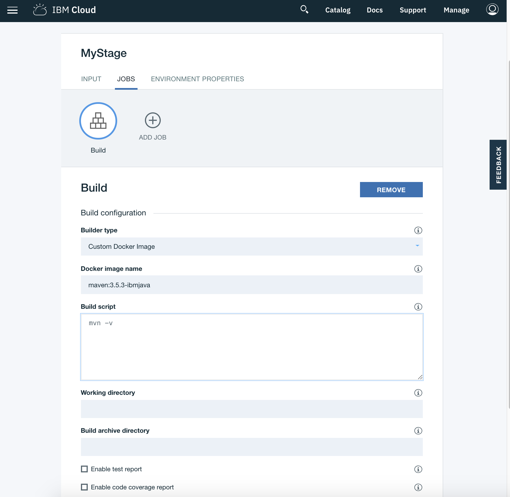
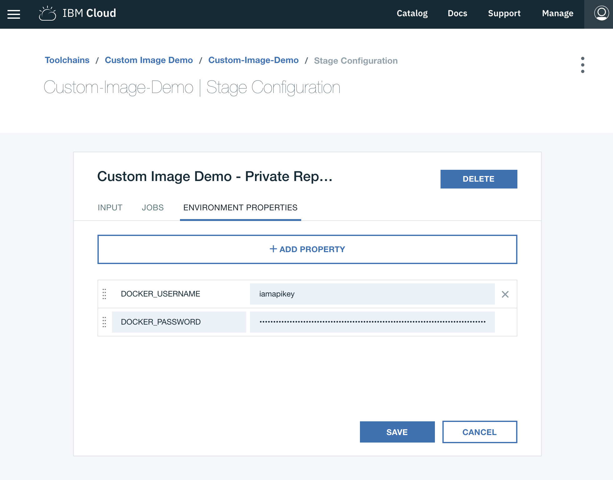

---

copyright:
  years: 2018
lastupdated: "2018-4-4"
---
<!-- Copyright info at top of file: REQUIRED
    The copyright info is YAML content that must occur at the top of the MD file, before attributes are listed.
    It must be surrounded by 3 dashes.
    The value "years" can contain just one year or a two years separated by a comma. (years: 2014, 2016)
    Indentation as per the previous template must be preserved.
-->

{:new_window: target="_blank"}
{:shortdesc: .shortdesc}
{:screen:.screen}
{:codeblock:.codeblock}

# Working with custom docker images

At some point you may find that the pipeline base image is no longer meeting your build's needs and you for example need
fine-grained control over the versions of node, java or other tools used. You can address the problem by having a
first step in your jobs that installs a series of new packages and carefully configures things like PATH to setup your
environment. A much better alternative is to use the pipeline's support for running a "Custom Docker Image" as
your job's basis.

Each job type (Build, Test, Deploy) gives the option to select a "Custom Docker Image" sub-type that allows you to
take control of your job and provide the "Docker image name" to be used and the "script" to run. For example, to run
a Build job using Maven 3.5.3 and IBM Java you would use:

## Specifying the Docker image name

The **docker image name** in custom docker image jobs is designed to work the same way as image names do with the Docker CLI. For example, for `docker run maven:3.5.3-ibmjava`, the docker image name is `maven:3.5.3-ibmjava`. The one exception is if this field is left blank in which case the "standard pipeline base image" will be used as a default. Apart from that there are no restrictions and any docker image should work.

A docker image name consists of `[repository][:][tag]`. In our example, our repository is `maven` and our tag is `3.5.3-ibmjava`. 

By default your repository is looked up at DockerHub (https://hub.docker.com/) however if you use another docker registry like IBM Cloud Registry you can supply the full DNS name. Even for images at Docker Hub you can use the fully qualified name -- `registry.hub.docker.com/library/maven:3.5.3-ibmjava`.

The image's `tag` is optional and if not set defaults to `latest` although you should be careful to understand what this means. `latest` is just a tag name that has to be managed by the repository owner and does not necessarily mean the actual chronologically "latest" image.

There is large vibrant community of repositories you can use at DockerHub. IBM hosts a number of public repositories at  (https://hub.docker.com/u/ibmcom/) that the IBM Cloud team uses. `ibmcom/ibmjava` and `ibmcom/ibmnode` are particularly useful to build upon. 

### Using a private registry image registry ###

If you are using a private registry that requires authentication you will need to set two additional stage environment properties: `DOCKER_USERNAME` and `DOCKER_PASSWORD`. To mask your DOCKER_PASSWORD you can use a "secure property. Before your image is pulled the custom docker image job will perform a `docker login` using the username and password credentials you supplied.

For most registries use the username/password you were given, but if using IBM Cloud Registry to store your private images you use a platform API Key for authentication. First request a Platform API Key (https://console.bluemix.net/iam/#/apikeys)and then be careful to save it! Create the two stage environment properties using `iamapikey` for your `DOCKER_USERNAME` and the API Key that you saved earlier for the `DOCKER_PASSWORD`.

## Specifying the Script ##

The **script** block in custom docker image jobs is used to create a script file that will be executed in a task folder
similar to how regular pipeline jobs work. One thing to recognize is that the docker images `ENTRYPOINT` and `CMD` are over-ridden and **will not** be called. In some cases you might have to directly run an `ENTRYPOINT` initialization step.

Custom docker image jobs however give you greater flexibility of how to run your script and in particular will let you control the command interpreter. As usual, if the first line of the script begins with #! and the name of a command interpreter, that will be used to execute the commands in the job. If you do not specify a command interpreter, the default shell for the docker image will be used. Typically `#!/bin/bash` or `#!/bin/sh` are used but with an appropriate docker image command interpreters for `awk`, `node` and `ruby` will also work.

